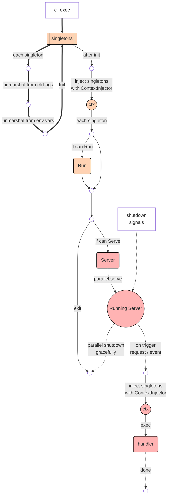

# Infra

## Code Structure

```
cmd/
    <app_name>/
        main.go
        <sub_cmd>.go    
internal/                   # internal pkgs
pkg/                        # shared pkgs       
```

## Singleton in Context



```go
package main

import (
	"context"

	"github.com/octohelm/x/logr"
	"github.com/innoai-tech/infra/pkg/otel"
	"github.com/innoai-tech/infra/pkg/cli"
)

var App = cli.NewApp("app", "0.0.0")

func init() {
	cli.AddTo(App, &Server{})
}

type Server struct {
	// declare as sub command
	// tag component is special set
	// when define, --dump-k8s added, for dump kube app component cue files 
	cli.C `component:"server"`

	// singleton
	// with interface { InjectContext() context.Context },
	// we could get singleton from context
	otel.Otel

	// Runner singleton
	// run once when cli exec
	Runner

	// Server singleton
	// start serve when cli exec
	// if multi servers exists, will parallel serve.
	ServerOrAgent
}

type Runner struct {
}

func (r *Runner) Run(ctx context.Context) error {
	// get singleton from ctx
	logr.FromContext(ctx).Info("run")
	return nil
}

type ServerOrAgent struct {
	// expose could be http/tcp/udp
	// generating services into cue files only when this setting defined.
	Addr string `flag:",omitempty,expose=http"`
}

func (r *ServerOrAgent) Serve(ctx context.Context) error {
	return nil
}

func (r *ServerOrAgent) Shutdown(ctx context.Context) error {
	return nil
}
```